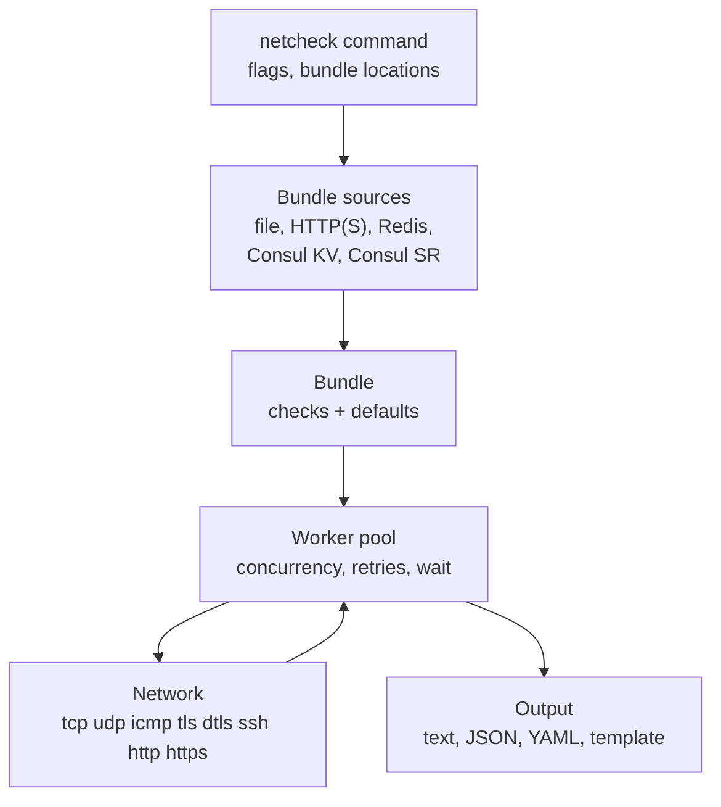

# netcheck architecture

How a run flows from the command line to the printed result.

```mermaid
flowchart TB
    cli["netcheck command<br/>flags, bundle locations"]
    src["Bundle sources<br/>file, HTTP(S), Redis,<br/>Consul KV, Consul SR"]
    bundle["Bundle<br/>checks + defaults"]
    pool["Worker pool<br/>concurrency, retries, wait"]
    net["Network<br/>tcp udp icmp tls dtls ssh http https"]
    out["Output<br/>text, JSON, YAML, template"]
    cli --> src --> bundle --> pool
    pool --> net
    net --> pool
    pool --> out
```
