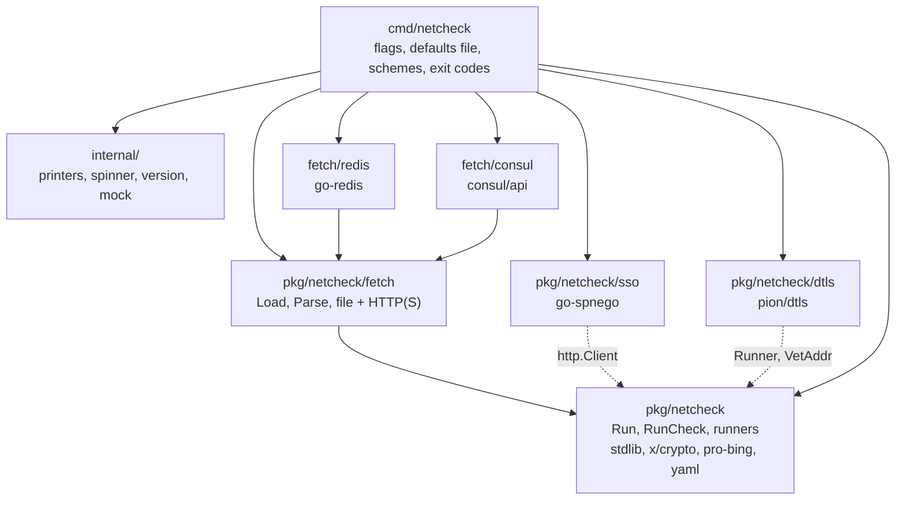

# netcheck packages

The packages, and what each pulls in.

```mermaid
flowchart TB
    cmd["cmd/netcheck<br/>flags, defaults file, schemes, exit codes"]
    internal["internal/<br/>printers, spinner, version, mock"]
    fetch["pkg/netcheck/fetch<br/>Load, Parse, file + HTTP(S)"]
    redis["fetch/redis<br/>go-redis"]
    consul["fetch/consul<br/>consul/api"]
    sso["pkg/netcheck/sso<br/>go-spnego"]
    dtls["pkg/netcheck/dtls<br/>pion/dtls"]
    core["pkg/netcheck<br/>Run, RunCheck, runners<br/>stdlib, x/crypto, pro-bing, yaml"]
    cmd --> internal
    cmd --> fetch
    cmd --> redis
    cmd --> consul
    cmd --> sso
    cmd --> dtls
    redis --> fetch
    consul --> fetch
    fetch --> core
    sso -.->|"http.Client"| core
    dtls -.->|"Runner, VetAddr"| core
    cmd --> core
```
