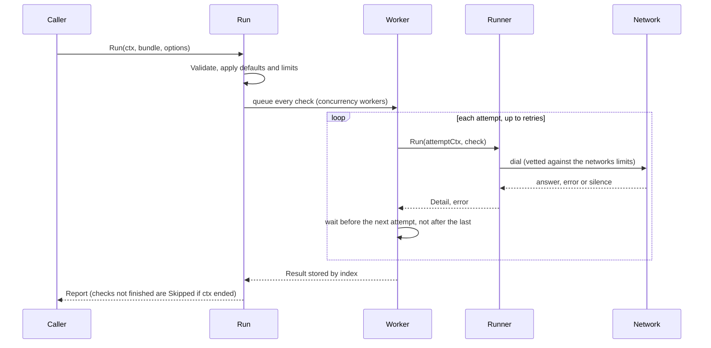

# netcheck run

What happens to one check.

```mermaid
sequenceDiagram
    participant C as Caller
    participant R as Run
    participant W as Worker
    participant P as Runner
    participant N as Network
    C->>R: Run(ctx, bundle, options)
    R->>R: Validate, apply defaults and limits
    R->>W: queue every check (concurrency workers)
    loop each attempt, up to retries
        W->>P: Run(attemptCtx, check)
        P->>N: dial (vetted against the networks limits)
        N-->>P: answer, error or silence
        P-->>W: Detail, error
        W->>W: wait before the next attempt, not after the last
    end
    W-->>R: Result stored by index
    R-->>C: Report (checks not finished are Skipped if ctx ended)
```
